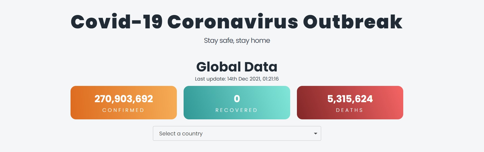
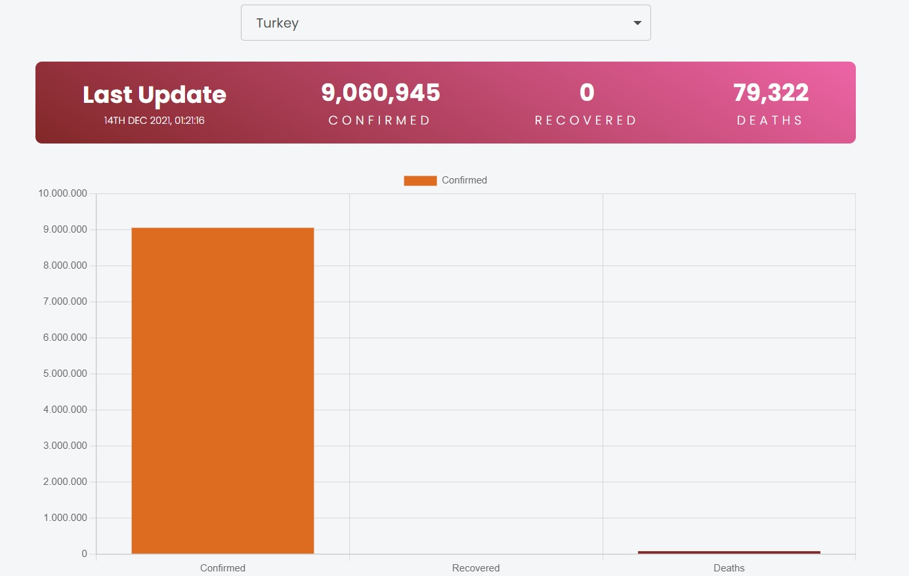
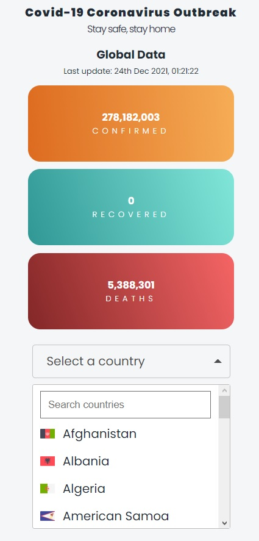
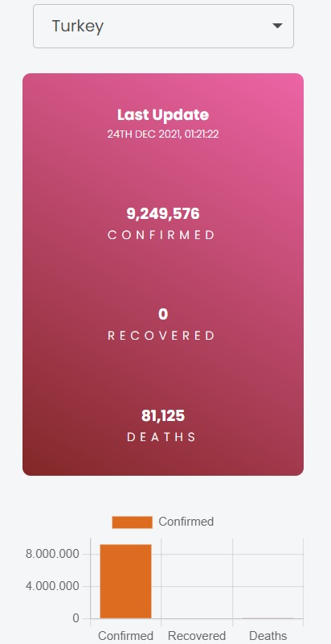

# Getting Started with Create React App

This project was bootstrapped with [Create React App](https://github.com/facebook/create-react-app).

## Live
[Link](https://covid19-tracker-lime.vercel.app)

## Technologies and Tools I use

Redux, SASS, Axios, Chart.js, Country-data, React-flags-select, React-moment, Use-count-up

## Photos

## Data From
[Covid-19 API](https://github.com/mathdroid/covid-19-api).

## Available Scripts

In the project directory, you can run:

### `yarn start`

Runs the app in the development mode.\
Open [http://localhost:3000](http://localhost:3000) to view it in the browser.

The page will reload if you make edits.\
You will also see any lint errors in the console.
